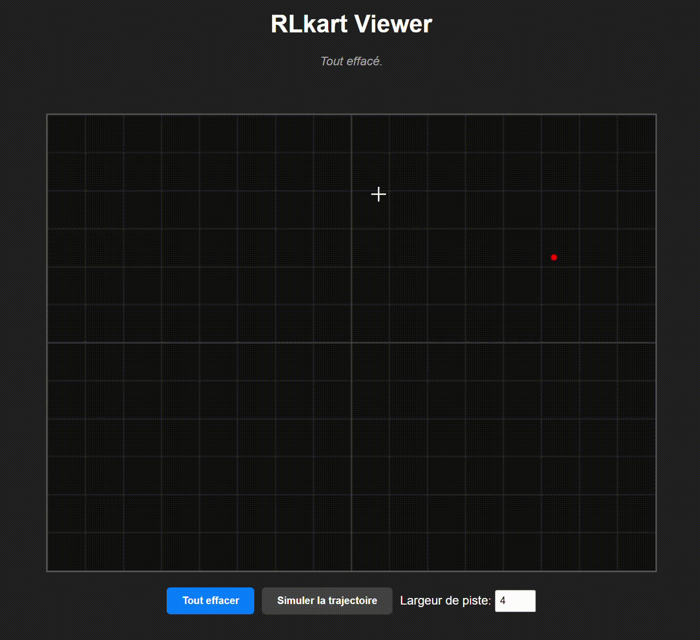

# RLkart 🏎️ 🤖

RLkart is a kart racing simulation platform powered by Reinforcement Learning. The project combines a physics engine (PyBullet), state-of-the-art AI algorithms (Stable Baselines3), and an interactive web interface for designing custom tracks.




## 🌟 Features

- **Reinforcement Learning**: Agent training using the PPO (Proximal Policy Optimization) algorithm.
- **Web Track Editor**: JS interface allowing the creation of complex layouts using Catmull-Rom splines.
- **Physics Simulation**: Powered by PyBullet for realistic collision management, acceleration, and friction.
- **API**: Simulations calculated server-side and smoothly visualized on the client-side.

## 🏗️ Project Architecture

```text
RLkart/
├── api.py                 # FastAPI server and request management
├── APISimulator.py        # Optimized "headless" simulator (API)
├── BaseSimulator.py       # Base simulation class (Gymnasium Env)
├── Car.py                 # Physics logic and car models (Manual/RL)
├── GenTrack.py            # Track generation and spline engine
├── RLModels.py            # SB3 training and loading manager
├── TrainSimulator.py      # Main training script
├── TestSimulator.py       # Local test script with PyBullet GUI
├── Models/                # Trained PPO models (.zip & .pkl)
└── frontend/              # Web user interface (HTML/JS)
```

## 🚀 Installation

### 1. Clone the project
```bash
git clone https://github.com/Nchpg/RLkart.git
cd RLkart
```

### 2. Create a virtual environment
```bash
python -m venv .venv
source .venv/bin/activate
```

### 3. Install dependencies
```bash
pip install fastapi uvicorn pybullet gymnasium stable-baselines3 shimmy numpy torch
```

## 🎮 Usage

### Launch the Interactive Viewer (Web)
Start the API server:
```bash
python api.py
```
Then open your browser at [http://localhost:8000](http://localhost:8000).

1. **Draw** your track by clicking on the canvas (min. 3 points).
3. **Simulate** to see the AI navigate your creation in real-time on the web.

### Launch Local Test (PyBullet GUI)
To see the AI driving directly in the PyBullet engine:
```bash
python TestSimulator.py
```

### Train a model
To start a new training session on random tracks:
```bash
python TrainSimulator.py
```

## 🧠 AI Details

The agent uses an observation vector including:
- Local velocity (longitudinal and lateral).
- Angular velocity.
- Cross-track error (distance to centerline).
- 8 proximity rays (Lidar) to detect track boundaries.
- Track curvature anticipation (look-ahead angles at 10, 20, and 40 points).

The reward function prioritizes track progression while penalizing off-track excursions, directional instability (shaking), and encouraging high speed.

## 🛠️ Technologies
- **Backend**: Python 3.9+, FastAPI, Uvicorn.
- **AI**: Stable Baselines3 (PPO), Gymnasium.
- **Physics**: PyBullet.
- **Frontend**: HTML5 Canvas, JavaScript (ES6).